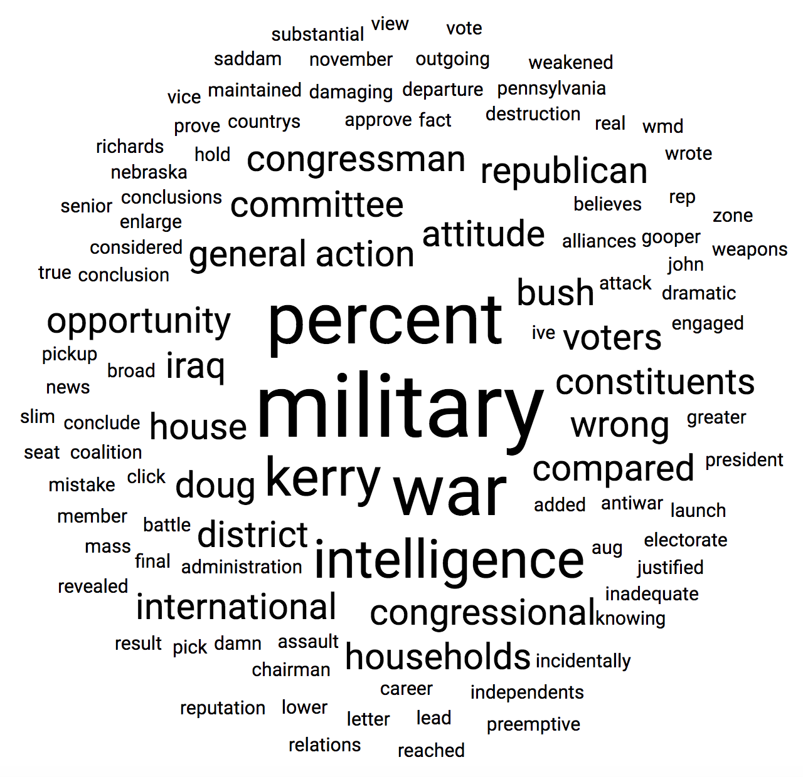

# core

This directory contains the core implementations. All the code in this directory does not depend on React in any way.

The main parts are:

## Data loading

* [load-dataset.ts](./load-dataset.ts)

## Visualizations using D3.js

We have implemented two different visualizations – scatterplot and wordcloud (Wordle).
Both visualizations are using only low-level D3.js primitives to create an **interactive and responsive** [SVG]-based
visualizations. They support _pan and zoom_, _selection_ and _filtering_.

* [scatterplot.ts](./scatterplot.ts) – `Scatterplot`
* [wordcloud.ts](./wordcloud.ts) – `WordCloud`

* [wordle.ts](./wordle.ts) - the “Wordle” algorithm implementation,
  used inside [`WordCloud.mapData()`](./wordcloud.ts#L169-L200)

  

<!-- links references -->

[SVG]: https://developer.mozilla.org/en-US/docs/Web/SVG
